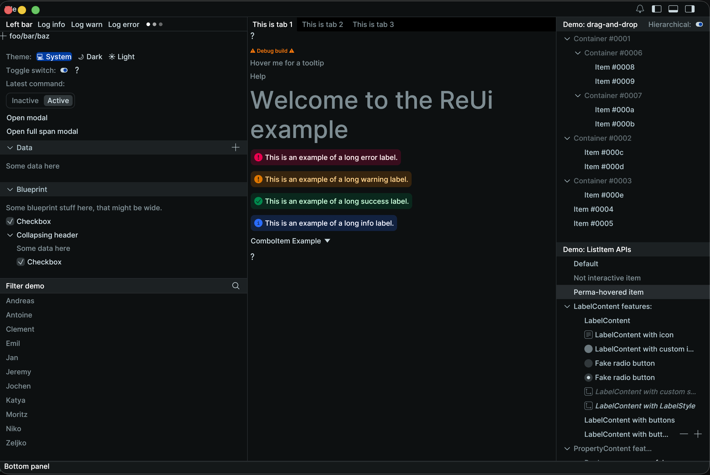

# rerun_ui_kit

Rerun's egui design system, vendored as a standalone crate.

Extracted from [`re_ui` 0.30.2](https://github.com/rerun-io/rerun/tree/0.30.2/crates/viewer/re_ui)
(MIT OR Apache-2.0) with the rerun data stack removed: the published `re_ui`
crate unconditionally pulls in `eframe` and 30+ `re_*` platform crates
(`re_entity_db`, `re_chunk`, `re_protos`, …). This port keeps the full widget
set but only depends on egui plus a handful of small pure-Rust libraries.



## What's inside

All of `re_ui`'s UI modules: design tokens (dark/light themes, Inter font),
`modal`, `list_item`, `menu`, `notifications`, `filter_widget`,
`command_palette`, `section_collapsing_header`, `drag_and_drop`, `help`,
`syntax_highlighting`, `text_edit`, `time` / `time_drag_value` /
`relative_time_range`, `alert`, `button`, `combo_item`, `loading_indicator`,
`icons`, and assorted extension traits (`UiExt`, `ContextExt`, …).

## What was removed

- All `re_*` platform dependencies. `re_log` → `log`, `re_mutex` →
  `parking_lot`, `re_format` → vendored in `src/format/`, time types
  (`TimeInt`, `Timestamp`, `TimeType`, …) → simplified ports in
  `src/time_types.rs` (plain `i64` newtype, no arrow/`NonMinI64` machinery).
- `syntax_highlighting` impls for rerun's data types (`EntityPath`,
  `ComponentPath`, …) — they only make sense with rerun's data model.
- macOS traffic-light window chrome, design-token hot reload (`notify`),
  analytics hooks, rerun brand logos, `format_f16`.
- Snapshot tests whose reference images are not published with the crate are
  marked `#[ignore]`.

## Usage

```toml
[dependencies]
rerun_ui_kit = "0.1"
```

```rust
// Once, at startup: installs the rerun theme (colors, spacing, Inter font,
// image loaders) into the egui context.
rerun_ui_kit::apply_style_and_install_loaders(&egui_ctx);

// Then use the widgets, e.g. a rerun-style modal:
let mut modal = rerun_ui_kit::modal::ModalHandler::default();
modal.open();
modal.ui(
    &egui_ctx,
    || rerun_ui_kit::modal::ModalWrapper::new("Title"),
    |ui| {
        ui.label("Content");
    },
);
```

## Development

```sh
cargo test                          # unit tests
cargo run --example rerun_ui_kit_example   # widget gallery (native)
cargo check --target wasm32-unknown-unknown
```

## License

MIT OR Apache-2.0, same as the upstream rerun project. See `LICENSE-MIT` and
`LICENSE-APACHE`. The bundled Inter font is covered by `data/OFL.txt`.
